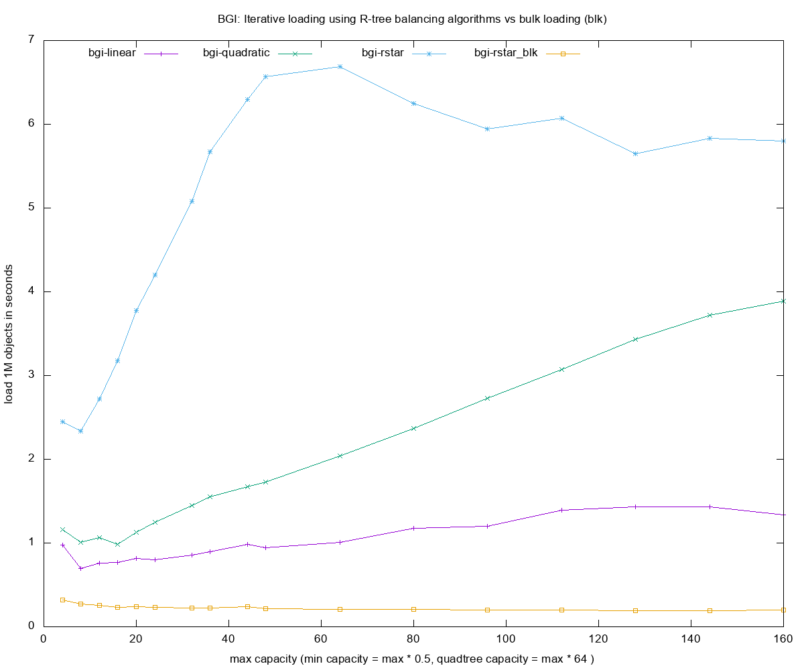
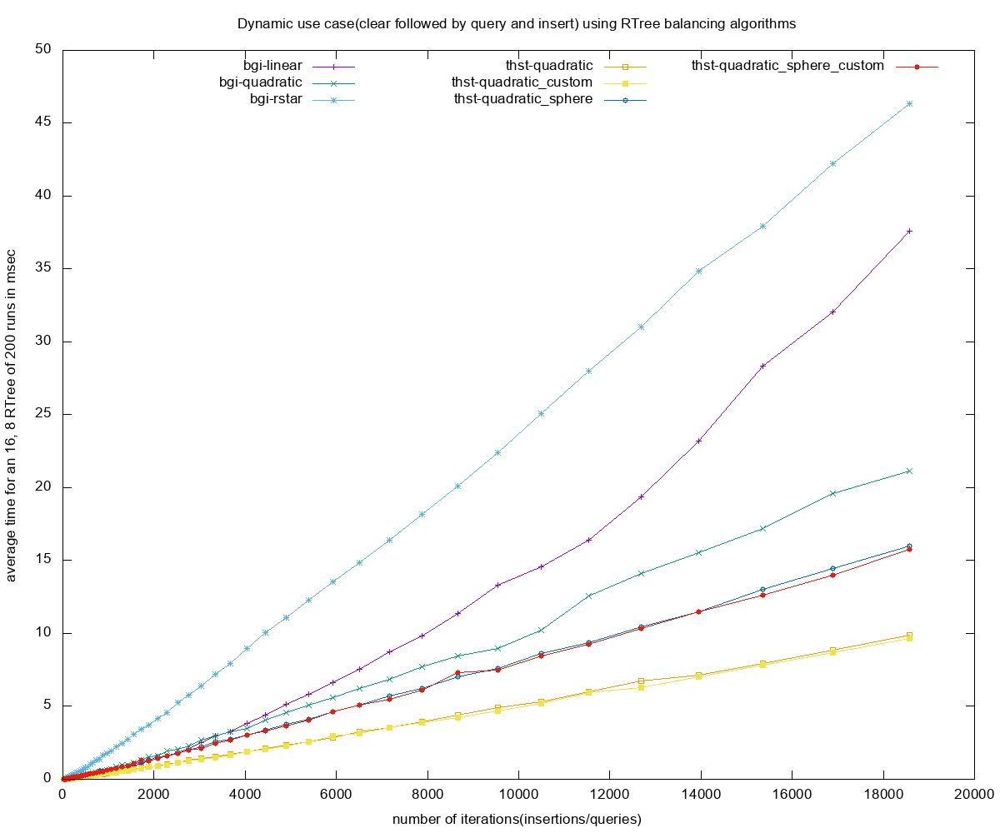

# Hierarchical spatial trees [](https://travis-ci.org/tuxalin/THST)
Templated hierarchical spatial trees designed for high-performance and hierarchical spatial partitioning use cases.

## Features

There are two tree implementations, a multi-dimensional RTree and a two-dimensional QuadTree.

Some of the currently implemented features are:
- hierarchical, you can add values to the internal branch nodes or traverse them
- leaf and depth-first tree traversals for spatial partitioning, via custom iterators
- custom indexable getter similar to boost's
- hierarchical query
- nearest neighbour search
- conditional insert with custom predicates
- support for custom allocators for internal nodes
- estimation for node count given a number of items
- tagging of internal nodes
- the spatial trees have almost identical interfaces
- C++03 support
	
## Installation

The implementation is header only, it's only requirement is at least (C++03) support.

## Usage

How to create and insert items to the trees:
```cpp
  	spatial::QuadTree<int, Box2<int>, 2> qtree(bbox.min, bbox.max);
  	spatial::RTree<int, Box2<int>, 2> rtree;

	const Box2<int> kBoxes[] = {...};
  	qtree.insert(kBoxes, kBoxes + sizeof(kBoxes) / sizeof(kBoxes[0]));
  	rtree.insert(kBoxes, kBoxes + sizeof(kBoxes) / sizeof(kBoxes[0]));
    
  	Box2<int> box = {{7, 3}, {14, 6}};
  	qtree.insert(box);
  	rtree.insert(box);
``` 	

Conditional insert:
```cpp
    const decltype(rtree)::bbox_type boxToAdd = {{7, 4}, {14, 6}};
    bool wasAdded =
        rtree.insert(boxToAdd, [&boxToAdd](const decltype(rtree)::bbox_type &bbox) {
          return !bbox.overlaps(boxToAdd);
        });
``` 

How to use the indexable getter:
```cpp
 	struct Object {
  		spatial::BoundingBox<int, 2> bbox;
  		std::string name;
  	};

  	// helps to get the bounding of the items inserted
  	struct Indexable {
    	const int *min(const Object &value) const { return value.bbox.min; }
    	const int *max(const Object &value) const { return value.bbox.max; }
  	};

  	spatial::QuadTree<int, Object, 2, Indexable> qtree(bbox.min, bbox.max);
  	qtree.insert(objects.begin(), objects.end());

  	spatial::RTree<int, Object, 2, 4, 2, Indexable> rtree;
  	rtree.insert(objects.begin(), objects.end());
``` 

Leaf and depth traversal:
```cpp
	spatial::RTree<int, Object, 2, 4, 2, Indexable> rtree;

    // gives the spatial partioning order within the tree
    for (auto it = rtree.lbegin(); it.valid(); it.next()) {
      std::cout << (*it).name << "\n";
    }

    assert(rtree.levels() > 0);
    for (auto it = rtree.dbegin(); it.valid(); it.next()) {

      // traverse current children of the parent node(i.e. upper level)
      for (auto nodeIt = it.child(); nodeIt.valid(); nodeIt.next()) {
        std::cout << "level: " << nodeIt.level() << " " << (*nodeIt).name
                  << "\n";
      }
      // level of the current internal/hierachical node
      std::cout << "level: " << it.level() << "\n";
    }
```

How to use the search algorithms:
```cpp
    Box2<int> searchBox = {{0, 0}, {8, 31}};

    std::vector<Box2<int>> results;
    rtree.query(spatial::intersects<2>(searchBox.min, searchBox.max), std::back_inserter(results));
    rtree.query(spatial::contains<2>(searchBox.min, searchBox.max), std::back_inserter(results));

    // to be used only if inserted points into the tree
    rtree.query(spatial::within<2>(searchBox.min, searchBox.max), std::back_inserter(results));

    // hierachical query that will break the search if a node is fully contained
    rtree.hierachical_query(spatial::intersects<2>(searchBox.min, searchBox.max), std::back_inserter(results));

    // neatest neighbor search
    rtree.nearest(point, radius, std::back_inserter(results));
```

Be sure to check the test folder for more detailed examples.

## Benchmarks

Benchmark setup is based on [spatial_index_benchmark](https://github.com/mloskot/spatial_index_benchmark) by Mateusz Loskot and Adam Wulkiewicz.

Complete set of result logs in [results](results) directory.

### Results

HW: Intel(R) Core(TM) i7-4870HQ CPU @ 2.50GHz, 16 GB RAM; OS: macOS Sierra 10.12.16

* Loading times for each of the R-tree construction methods





* Query times for each of the R-tree construction methods


* Dynamic use case, average time for each of the R-tree construction methods



For more detailed benchmark results check the results folder.

### Legend
------

* ```bgi``` - boost::geometry::index, compile time
* ```thst``` - thst
* ```ct``` - compile-time specification of rtree parameters
* ```rt``` (or non suffix) - Boost.Geometry-only, run-time specification of rtree parameters
* ```L``` - linear
* ```Q``` - quadratic
* ```QT``` - quadtree
* ```R``` - rstar
* ```itr (or no suffix)```  - iterative insertion method of building rtree
* ```blk```  - bulk loading method of building R-tree (custom algorithm for ```bgi```)
* ```custom``` - custom allocator variant for thst(cache friendly, linear memory)
* ```sphere``` - sphere volume for computing the boxes's volume, better splitting but costlier
* insert 1000000 - number of objects small random boxes
* query   100000 - number of instersection-based queries with random boxes 10x larger than those inserted
* dynamic 200 - number of runs composed of clear, instersection-based queries and insert with small random boxes

## Future improvements

Possible improvements are:
- RTree bulk loading
- reduced memory footprint for 1D and leaves
- support for multiple splitting heuristics
- SSE optimizations

## Contributing

Based on:
- 1983 Original algorithm and test code by Antonin Guttman and Michael Stonebraker, UC Berkely
- ANCI C ported from original test code by Melinda Green
- Sphere volume fix for degeneracy problem submitted by Paul Brook
- Templated C++ port by Greg Douglas
- N-dimensional RTree implementation in C++ by nushoin (https://github.com/nushoin/RTree).
- Nearest neighbour search by Thinh Nguyen (http://andrewd.ces.clemson.edu/courses/cpsc805/references/nearest_search.pdf).

Bug reports and pull requests are welcome on GitHub at https://github.com/tuxalin/thst.

## License

The code is available as open source under the terms of the [MIT License](http://opensource.org/licenses/MIT).
