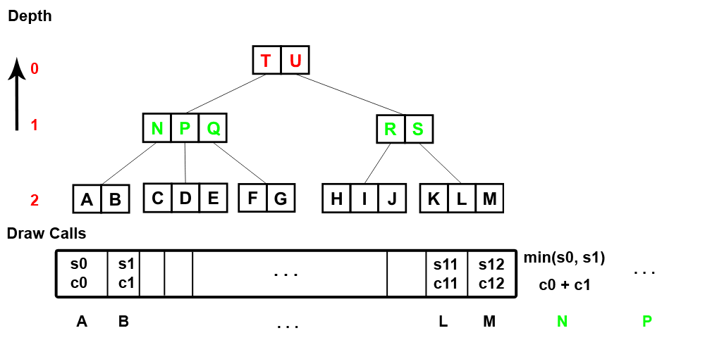
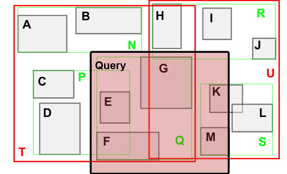

## Usage examples

### Batching draw calls using hierarchical trees

Consider the following example, for simplicity it's in 2D space.

The leaves represent draw calls(eg. game objects) in world coordinates, they can be represented in the tree values by some IDs or indices in some arrays.

#### Spatial order
Insert the objects in any order, after a leaf traversal(via the leaf iterator) must be done which will give the spatial order of the objects:

NOTE: The spatial tree has a translate method which will be applied to the boxes of all the nodes and leaves.

#### Buffer spatial ordered layout
Afterwards using the spatial order we insert the object's data in a vertex buffer(if applicable, also to an index buffer or more vertex buffers) and save the draw call start and count for the objects:

NOTE: It's required that all calls must use the same primitive type.

This way the interleaved data(or indices if using an index buffer) will be spatially ordered.

#### Depth nodes
The final step is to do a depth traversal(via the depth and node iterators) starting from the penultimate level towards the root level(eg. zero).
For each depth node access it's children draw calls and append new ones, where the start is the minimum of it's children and count is the sum:

NOTE: The traversal is done in reverse, from the level one downards, in left to right order.

We also set the new values(eg. an ID or address) of depth nodes which will link to the new draw calls.

#### Hierachical query
When using hierachical query the values/objects that are fully contained by the query box will be returned and the other branches pruned.

NOTE: The quad tree variant has a containment factor, if the number of nodes contained exceed the given percentage then the depth node is selected.

In the above example the query would return the draw calls for: Q(composed of F and G), E, K and M.
Note that further optimizations can be done for adjiacent nodes(as they can be merged).